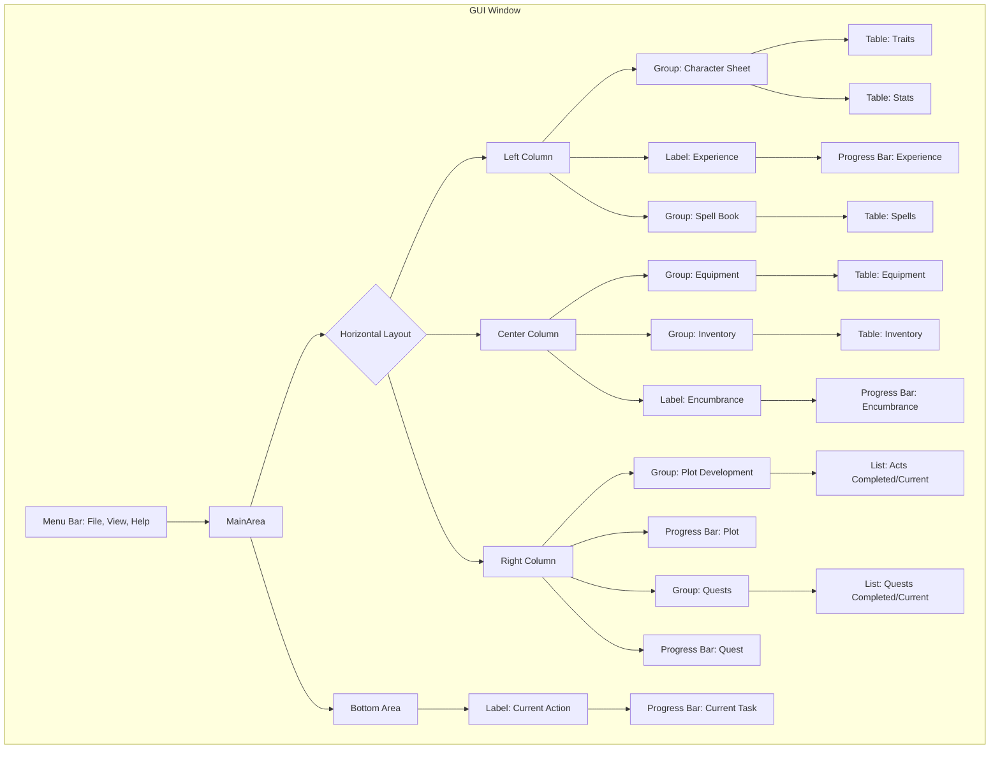

<!-- Zero Source Specification v1.0 -->
<!-- ZS:PROJECT:ProgressQuestTINSEdition -->
<!-- ZS:TYPE:DesktopApplication -->
<!-- ZS:PLATFORM:CrossPlatform -->
<!-- ZS:LANGUAGE:Python -->
<!-- ZS:UI_TOOLKIT:PySide6 -->
<!-- ZS:COMPLEXITY:HIGH -->

# Progress Quest TINS Edition

## Description

This project describes "Progress Quest TINS Edition", a desktop application implementing the classic zero-player game, Progress Quest. Progress Quest is a satirical take on fantasy role-playing games where the character progresses automatically without any player interaction beyond initial character creation. The player's role is simply to watch their character embark on adventures, complete quests, gain levels, acquire loot, and interact with a simulated world.

This README serves as the sole source for an AI Language Model (LLM) to generate the complete, functional Python application using the PySide6 GUI toolkit. The goal is to replicate the core experience of Progress Quest in a desktop environment, focusing on the display of character progression and status.

## Functionality

### Core Features

1.  **Zero-Player Gameplay:** The application runs automatically once a character is loaded or created. The character performs actions like killing monsters, traveling, buying/selling items, and completing quests without user input.
2.  **Character Creation:** Allows users to "roll" a new character, including:
    *   Generating or entering a character name.
    *   Selecting a Race and Class from predefined lists, each providing specific stat bonuses.
    *   Rolling primary stats (STR, CON, DEX, INT, WIS, CHA) using a 3d6 method.
    *   Displaying rolled stats and their total.
    *   Ability to "Reroll" stats and "Unroll" to previous rolls.
    *   Saving the new character, potentially overwriting existing characters with the same name after confirmation.
3.  **Character Progression:**
    *   Characters gain Experience (XP) over time by completing productive tasks (excluding buying, selling, market, and travel tasks).
    *   XP gain is tied to the number of tasks completed along with player level.
    *   Characters level up upon reaching XP thresholds, gaining improved stats (HP/MP Max), learning/improving spells, and enhancing base stats.
    *   Characters progress through Plot Acts, starting from Prologue, with increasingly longer completion times.
    *   Characters undertake and complete Quests automatically.
4.  **Inventory and Equipment:**
    *   Characters automatically acquire equipment for various slots (Weapon, Helm, Armor pieces, etc.). Better equipment replaces worse equipment.
    *   Characters accumulate items (loot from monsters, quest rewards, special items) in an inventory.
    *   Characters manage Encumbrance based on inventory items (excluding Gold) relative to their Strength (STR).
    *   When at market, the character will sell items in multiple cycles (up to 3 times) before checking for equipment upgrades.
    *   When the character has gold, it will buy all possible equipment upgrades until no more affordable upgrades are available.
    *   When at market, the character will only check for equipment upgrades if it has enough gold to buy better equipment; otherwise it will skip the 'Checking for equipment upgrades' task entirely.
    *   Gold is acquired through selling items and completing tasks.
5.  **Spells:** Characters automatically learn and improve spells from a predefined list, influenced by their Wisdom (WIS) and Level.
6.  **Task System:** The character's current action is displayed, along with a progress bar showing time until completion. Actions are determined by a task queue and game logic (e.g., fighting, traveling, selling, plot cinematics).
7.  **Persistence:**
    *   Character state is saved automatically at regular intervals and upon closing the application.
    *   Character state can be saved manually via a menu option.
    *   Characters are saved to individual `.pqw` files (Base64 encoded JSON) in a `./savegame` directory.
    *   The application automatically loads the most recently modified `.pqw` file on startup.
    *   Users can manually load any `.pqw` file via a menu option (files outside the save directory are copied in).
8.  **Theming:** The application uses the Fusion style directly instead of stylesheets for theming and implements Auto/Light/Dark color schemes with Dark as default. The UI layout uses 2 vertical splitters for better organization.
9.  **UI Display:** Provides a comprehensive view of the character's status, including traits, stats, equipment, inventory, spells, plot progression, quest log, and current action. The UI displays console log messages like sold items, purchases, and auto-save notifications in the status bar.

### User Interface

The main application window is structured with a three-column layout using splitters:



**Key UI Elements & Behavior:**

*   **Window Title:** Displays "Progress Quest TINS Edition - \[Character Name]".
*   **Menu Bar:**
    *   **File:** New Character, Load .pqw File, Save .pqw File, Exit.
    *   **View:** Color Scheme (Auto, Light, Dark).
    *   **Help:** Visit Repository (opens GitHub URL), About (shows license/info dialog).
*   **Tables (Traits, Stats, Spells, Equipment, Inventory):**
    *   Display data in two columns with right-aligned value columns (e.g., "Trait", "Value" or "Slot", "Item").
    *   Value columns are narrower and right-aligned for better readability.
    *   Character sheet and equipment sections don't have scrollbars and display all items.
    *   Tables have reduced cell/line height for better space utilization.
    *   Table headers are less tall and grid lines don't compete with text.
    *   Vertical headers (row numbers) should be hidden.
    *   Content should be non-editable by the user.
    *   Selection should be disabled.
    *   Column widths should adjust appropriately (some fixed, some stretch).
    *   Rows should be compact.
    *   Tables should update dynamically as game state changes. Inventory/Spells tables resize rows dynamically. Equipment/Traits/Stats tables have fixed rows.
*   **Lists (Plots, Quests):**
    *   Display single columns of text items.
    *   Selection should be disabled.
    *   Items should be added dynamically.
    *   Lists should scroll to the bottom when new items are added (especially Plots on new Act, Quests on new quest) and at application start.
    *   Use icons/prefixes (e.g., `✓` for completed, `►` for current) to indicate status.
*   **Progress Bars (Exp, Encum, Plot, Quest, Task):**
    *   Visually represent progress from 0% to 100%.
    *   Display text indicating status (e.g., percentage, value/max, time remaining, hint text). Specific formats:
        *   Exp: "X XP needed - Y%" (tooltip: full hint)
        *   Encum: "Current/Max cubits" (tooltip: full hint)
        *   Plot: "Time remaining - Y%" (tooltip: full hint)
        *   Quest: "Y% complete" (tooltip: full hint)
        *   Task: "Y%" (tooltip: full hint)
    *   Update dynamically based on game state.
*   **Labels (Kill Label, Bar Labels):** Display static text or dynamic text (like the current action). Kill Label should be centered and bold, it should be informative of quatity and related info, not just Kill... or Hunt...
*   **Dialogs:**
    *   **New Character:** Fields for Name (with random Name generator '?' button), Radio buttons for Race/Class, Display area for rolled Stats (with Total and color coding), Roll/Unroll buttons, Sold! (Accept)/Cancel buttons.
    *   **About:** Displays application title, version, and license text.
*   **Layout:** Use nested layouts (QVBoxLayout, QHBoxLayout) and QGroupBox widgets to achieve the three-column structure. Columns should resize appropriately. Use stretch factors to allocate space (e.g., Right wider than Left/Center).

### Developer Mode Shortcuts
<!-- ZS:FEATURE_CATEGORY:DeveloperTools -->
For development, debugging, and testing purposes only, the following keyboard shortcuts are available. These shortcuts directly manipulate the game state or trigger specific game logic sequences. They should not be exposed to regular users or relied upon for normal gameplay.

*   **`F1`:** **Show Help:** Displays a simple message box listing all available developer shortcuts and their functions.
*   **`F2`:** **Decrease Game Speed:** Cycles the game speed multiplier *down* through the sequence: 10x -> 5x -> 2x -> 1xNormal (no wrap around). This multiplier affects the effective time elapsed calculated during each `_tick`, making the game progress slower. The base `TICK_INTERVAL_MS` of the `QTimer` remains unchanged. Initial speed is 1x.
*   **`F3`:** **Increase Game Speed:** Cycles the game speed multiplier *up* through the sequence: 1xNormal -> 2x -> 5x -> 10x (no wrap around). This multiplier affects the effective time elapsed calculated during each `_tick`, making the game progress faster. The base `TICK_INTERVAL_MS` of the `QTimer` remains unchanged.
*   **`F4`:** **Fill Inventory (Almost):** Adds random non-Gold inventory items using the standard item generation logic (`win_item`) until the character's current encumbrance (`EncumBar.position`) reaches `EncumBar.max - 1`. This facilitates testing the encumbrance and selling logic. The UI (`InventoryTable`, `EncumBar`) should update immediately.
*   **`F5`:** **Add Gold:** Adds a substantial, fixed amount of Gold (e.g., 1,000) directly to the character's inventory (`Inventory` array). This facilitates testing the equipment buying logic. The UI (`InventoryTable`) should update immediately.
*   **`F6`:** **Force Market Visit:** Interrupts the character's current task (`game_state.task`) and immediately initiates the standard market sequence: "Traveling to Market" -> "Selling Items" -> "if enough gold Buying Equipment" -> (repeat sell 3 times then if enough gold buy once) -> "Traveling back" -> "Hunting Grounds"/"Dungeon". This occurs regardless of the character's current encumbrance level. Normal market logic applies (e.g., items are only sold if present, equipment is only bought if affordable and an upgrade is available else skip buy, keep selling until no more items are present).
*   **`F7`:** **Set XP Near Level Up:** Sets the character's current experience points (`ExpBar.position`) to be exactly 1 XP less than the amount required for the next level (i.e., `ExpBar.position = ExpBar.max - 1`). This allows for quick testing of the level-up sequence by completing one more action that grants XP. The UI (`ExpBar`) should update immediately.
*   **`Ctrl+S`:** **Save Game:** Triggers the same manual save action as selecting "Save .pqw File" from the File menu. The `game_state` is saved to the character's `.pqw` file.
*   **`Ctrl+O`:** **Load Game:** Triggers the same manual load action as selecting "Load .pqw File" from the File menu. Displays the file dialog to choose a `.pqw` file.
*   **`Ctrl+Q`:** **Quit Application:** Triggers the same application exit sequence as selecting "Exit" from the File menu or closing the main window, including prompting for save if necessary.

### Behavior Specifications

1.  **Initialization:**
    *   Create the `./savegame` directory if it doesn't exist.
    *   Attempt to load the most recently modified `.pqw` file from `./savegame`.
    *   If successful, display the main window with the loaded character and resume the game loop.
    *   If no saves exist or loading fails, show the New Character dialog.
    *   If the New Character dialog is accepted, create the character, save it, and show the main window, starting the game loop.
    *   If the New Character dialog is cancelled, exit the application.

2.  **Game Loop (Tick-Based):**
    *   The fundamental unit of time is the **Tick**, driven by a `QTimer` triggering the `_tick` method at a constant `TICK_INTERVAL_MS` (100ms). The Tick itself has no visual representation or progress bar.
    *   `_tick` calculates the real time elapsed since the last tick and applies the game speed multiplier.
    *   This elapsed time is added to the progress of the **Current Task** (`TaskBar`).
    *   The game's overall **Elapsed Time** (`elapsed` field in `game_state`) is incremented, driving the **Plot Progression** (`PlotBar`).
    *   If the Current Task's progress reaches its duration, `process_task_completion` logic is executed.
    *   The `update_ui` function is called to refresh the display based on the potentially modified `game_state`, with throttling for performance.
    *   Handles auto-save countdown (every 60 seconds by default).

3.  **Task Execution & The Task Bar:**
    *   The `TaskBar` visually represents the progress of the character's current action (`game_state.task`).
    *   Tasks are categorized as **Productive** (e.g., killing monsters, specific quest actions) or **Non-Productive** (e.g., traveling, selling, buying, resting, plot cinematics). A predefined data structure maps task identifiers to their type and base duration.
    *   When the `TaskBar` completes:
        *   `process_task_completion` logic runs:
            *   Grants rewards based on the completed task (e.g., Gold, potentially 1 inventory item for kills).
            *   If the task was **Productive**, increments the **Quest Progress** (`QuestBar`).
            *   Always increments **Experience** (`ExpBar`) based on task duration and type (e.g., monsters yield more XP).
        *   Checks for Level Up, Quest Completion, or Plot Act Completion are performed if the respective bars filled due to the task's contribution.
        *   The next task is determined by the following priority:
            1.  Dequeue from the cinematic `queue` if not empty.
            2.  If `EncumBar` is full, initiate "Go to Market" -> "Sell Items" tasks.
            3.  If recently sold and has sufficient Gold, initiate "Buy Equipment" task.
            4.  Otherwise, determine the next **Productive** task (e.g., "Kill Monster" based on current Quest/Act/Level).
        *   The `KillLabel` (displaying the task description) and `TaskBar` (reset for the new task's duration) are updated.

4.  **Inventory, Encumbrance, and Economy:**
    *   Completing productive tasks (like killing monsters) typically yields 1 inventory item (non-Gold). Each such item consumes 1 unit of encumbrance capacity. Gold does *not* contribute to encumbrance.
    *   The `EncumBar` tracks current encumbrance relative to the maximum (derived from STR).
    *   When `EncumBar` reaches maximum:
        *   The character initiates a sequence of **Non-Productive** tasks: "Traveling to Market".
        *   Followed by "Selling Items". This task may repeat (e.g., up to 3 times) to clear space. Items are sold based on a value heuristic (lowest value first). Gold increases. Encumbrance decreases.
        *   After selling attempts, if sufficient Gold is available compared to the value of potential upgrades, the character initiates a **Non-Productive** "Buying Equipment" task. This checks if better equipment is available for purchase based on current Gold and level, replacing equipped items if a superior one is bought. Gold decreases.
        *   If no purchase is made (insufficient Gold or no upgrades available), or after a purchase, the character initiates a "Traveling back" task.
        *   Normal productive task cycle resumes.
5.  **Market Behavior:**
    *   When encumbrance is full, the character travels to market.
    *   At market, the character sells items in multiple cycles (up to 3 times by default).
    *   Items are sold based on a value heuristic (lowest value first).
    *   After selling, if the character has enough gold, it buys all possible equipment upgrades until no more affordable upgrades are available.
    *   When there's not enough gold, the character skips the 'Checking for equipment upgrades' task entirely.
    *   Sell tasks (4 seconds) are faster than buy tasks (6 seconds).
    *   The character completes all selling/buying cycles before returning to hunting grounds.

5.  **Experience and Leveling:**
    *   The `ExpBar` tracks progress towards the next level. XP is primarily gained from defeating monsters (productive task completion) and completing Quests and Plot Acts.
    *   Experience points increase based on completing productive tasks (excluding buying, selling, market, and travel tasks).
    *   XP gain is tied to the task duration, type multiplier, and player level.
    *   When the character levels up, HP/MP Max are recalculated, stats may increase slightly, and new spells may be learned or existing ones improved based on WIS, INT, and Level.
    *   XP required for the next level increases significantly with each level, following a curve approximating gamma interpolation.
        *   *Target Scale:* Level 1 -> 2 might take roughly 1 day of continuous play. Level 29 -> 30 might take roughly 6 months. Level 99 -> 100 might take roughly 1 year. These are tuning targets for the XP formula and reward values.
    *   When the `ExpBar` fills, `level_up` logic is triggered:
        *   Level increases by 1.
        *   Max HP/MP are recalculated and increased.
        *   Base stats (STR, CON, etc.) may increase slightly.
        *   New spells may be learned or existing ones improved based on WIS and Level.
        *   The `ExpBar` resets to 0, and its maximum value is recalculated based on the *new* level using the XP requirement formula.

6.  **Quest Progression:**
    *   The `QuestBar` tracks progress towards completing the current quest (the last entry in the `Quests` list).
    *   Progress is *only* made by completing **Productive** tasks.
    *   The number of productive tasks required increases with character level, following a curve approximating gamma interpolation.
        *   *Target Scale:* At Level 1, ~10 productive tasks complete a quest. At Level 30, ~30 tasks. At Level 100, ~50 tasks.
    *   When the `QuestBar` fills, `complete_quest` logic is triggered:
        *   Rewards are granted (XP, Gold, potentially items).
        *   If the `Quests` list exceeds its maximum display size (e.g., 100), the oldest quest is removed.
        *   A new quest is generated based on character level and PRNG.
        *   The new quest description is added to the `Quests` list.
        *   The `QuestBar` resets to 0, and its maximum value (representing required productive tasks) is recalculated based on the character's current level.

7.  **Plot Act Progression:**
    *   The `PlotBar` tracks progress through the current Plot Act (`act` number).
    *   Progress is driven *solely* by the total **Elapsed Game Time** (`elapsed` field) since character creation. It is independent of character level, tasks performed, or choices.
    *   The time required to complete each Act increases significantly, following a curve similar to XP requirements (gamma-like).
        *   *Target Scale:* The Prologue (Act 0) takes roughly 20 seconds of elapsed game time. Subsequent acts take exponentially longer.
    *   When the `PlotBar` fills based on `elapsed` time reaching the act's duration threshold, `complete_act` logic is triggered:
        *   Rewards are granted (XP, Gold).
        *   The `act` number is incremented.
        *   Cinematic tasks (e.g., "Loading...", "Experiencing an...") may be added to the `queue` for sequential execution before normal gameplay resumes.
        *   The `PlotBar` resets to 0, and its maximum value (the duration for the *new* act) is recalculated.
    *   The `PlotsList` displays the history of completed acts and the current one (potentially capped like the Quests list, e.g., last 100).

8.  **Saving/Loading:**
    *   Saving encodes the `game_state` dictionary (including all bar states, lists, counters, PRNG state) to JSON, then Base64, and writes to the `.pqw` file. Updates save timestamp.
    *   Loading reads the file, decodes Base64, parses JSON into `game_state`. Restores PRNG state. Merges loaded state with default schema to handle missing fields gracefully. Recalculates transient UI data like bar hints and current best stats/items/spells/quest descriptions. Resumes the game loop timer.

9.  **Save File Format:**
    *   Game state is saved as Base64-encoded JSON in `.pqw` files.
    *   When saving game data, double quotes are used for strings with apostrophes instead of single quotes to avoid formatting issues.
    *   OrderedDict is used for ExpBar, EncumBar, PlotBar, QuestBar, and TaskBar to maintain compatibility with the original file format.
    *   The PRNG state is saved and restored to ensure consistent random behavior across sessions.

10.  **Window Closing:** Stops the game timer, triggers an auto-save, and then closes the application. If saving fails, prompts the user whether to quit anyway.

## Technical Implementation

### Architecture

* **Model-View Separation (Implicit):**
  - **Model:** The `game_state` dictionary and the functions in `game.py` represent the core data model and business logic. The `game.py` file contains all non-GUI-related logic and is self-contained in the sense that it does not depend on any UI toolkit. This allows it to function independently of the GUI and facilitates testing, such as with a `game_cli.py` file that interacts only with the core logic.
  - **View and Controller:** Each GUI implementation (e.g., `main.py` for PySide6, `main_tkinter.py` for Tkinter) serves as both the View and Controller. GUI-specific modules manage event handling (e.g., infinite loops, user actions, timers), interact with `game.py` to manipulate game state, and update the user interface accordingly. These GUI modules are fully independent of one another, allowing you to swap out the GUI toolkit by replacing `main.py` with another implementation (e.g., `main_tkinter.py`).

* **Main Components:**
  - **`game.py`:** Contains all core game logic, including constants, data structures, PRNG, character creation, progression logic, task generation, and save/load helpers. It is lightweight, reusable, and testable without GUI requirements.
  - **`main.py`:** Contains the PySide6-specific application setup, `MainWindow` class, UI element definitions, layout, event handling (timer, menus), dialog implementations, and any other interaction with `game.py`. It handles the event loop and acts as the intermediary between the GUI and the core game logic.

* **Event Loop:**  
  - The event loop is GUI-specific and resides in the respective GUI modules (`main.py`, `main_tkinter.py`, etc.). For example, the PySide6 implementation in `main.py` relies on the `QTimer` mechanism to trigger game progression ticks, while Tkinter would use its own timing mechanism (e.g., `after` method).

### Key Advantages of This Design:
1. **Modularity:**  
   Each GUI module operates independently, making it easy to swap out `main.py` for another implementation, such as `main_tkinter.py`, without affecting `game.py`.

2. **Reusability:**  
   The `game.py` file remains free of GUI-related dependencies, ensuring that it can be reused for testing (`game_cli.py`) or other potential applications.

3. **Simplified Abstractions:**  
   Instead of introducing an additional interface layer (e.g., `interface.py`), all controller-like responsibilities are consolidated within each GUI module (e.g., `main.py` or `main_tkinter.py`), keeping the architecture straightforward.

### Save File Format (`.pqw`)

**Key Fields Handled by Save/Load Logic:**
The application persists the character's state in `.pqw` files located in the `./savegame` directory. These files contain a single Base64 encoded string, which, when decoded, reveals a JSON object representing the entire `game_state`.
Ensure the following fields (implicitly or explicitly covered by the structure) are handled correctly by the save/load logic:
- Traits.Level (updated by level_up)
- elapsed (updated by process_tick)
- Equips (updated by buying/win_equip)
- Inventory (updated by rewards/selling)
- Spells (updated by level_up)
- act (updated by complete_act)
- Quests (list updated by complete_quest)
- ExpBar, EncumBar, PlotBar, QuestBar, TaskBar (all fields updated by bar logic)
- queue (updated by complete_act, processed by determine_next_task)
- seed (updated on save, restored on load)
- task (updated by determine_next_task)
- kill (display text for current task, updated when task changes)

**Core Principles:**

1.  **Format:** Base64(JSON(game_state))
2.  **Strict Order:** Fields *must* appear in the JSON object exactly in the order defined below. This is critical for compatibility testing and consistent loading/saving across versions.
3.  **Type Integrity:** Each field must strictly adhere to the specified data type.
4.  **Completeness:** All fields defined in this structure must be present in a valid save file.

**JSON Structure Definition:**

The decoded JSON object adheres to the following structure and field order:

```json
{
  "Traits": { "Name": "", "Race": "", "Class": "", "Level": 0 },
  "dna": [0.0, 0.0, 0.0, 0], "seed": [0.0, 0.0, 0.0, 0],
  "birthday": "", "birthstamp": 0,
  "Stats": {
    "seed": [0.0, 0.0, 0.0, 0],
    "STR": 0, "best": "", "CON": 0, "DEX": 0, "INT": 0,
    "WIS": 0, "CHA": 0, "HP Max": 0, "MP Max": 0
  },
  "beststat": "", "task": "", "tasks": 0, "elapsed": 0,
  "bestequip": "",
  "Equips": {
    "Weapon": "", "Shield": "", "Helm": "", "Hauberk": "",
    "Brassairts": "", "Vambraces": "", "Gauntlets": "",
    "Gambeson": "", "Cuisses": "", "Greaves": "", "Sollerets": ""
  },
  "Inventory": [["Gold", 0]],
  "Spells": [["", ..., ""]], "act": 0, "bestplot": "", "Quests": ["", ..., ""],
  "questmonster": "", "kill": "",
  "ExpBar": { "position": 0.0, "max": 0, "percent": 0, "remaining": 0, "time": "", "hint": "" },
  "EncumBar": { "position": 0, "max": 0, "percent": 0, "remaining": 0, "time": "", "hint": "" },
  "PlotBar": { "position": 0.0, "max": 0, "percent": 0, "remaining": 0, "time": "", "hint": "" },
  "QuestBar": { "position": 0.0, "max": 0, "percent": 0, "remaining": 0, "time": "", "hint": "" },
  "TaskBar": { "position": 0, "max": 0, "percent": 0, "remaining": 0, "time": "", "hint": "" },
  "queue": ["", ..., ""], "date": "", "stamp": 0, "saveName": "",
  "bestspell": "", "bestquest": "", "questmonsterindex": -1
}
```

**Field Explanations:**

1.  **`Traits`** (`Object/Dictionary`)
    *   Contains fundamental character identification.
    *   `Name` (`String`): The character's chosen name.
    *   `Race` (`String`): The character's selected race.
    *   `Class` (`String`): The character's selected class.
    *   `Level` (`Unsigned Integer`): The character's current experience level.

2.  **`dna`** (`Array[Float, Float, Float, Unsigned Integer]`)
    *   The persistent state of the Pseudo-Random Number Generator (PRNG) *at the exact moment the character's initial stats were rolled*.
    *   Used by the "Unroll" feature during character creation to revert to previous stat rolls.
    *   Float values must preserve high precision (e.g., `0.1234567890123456`).

3.  **`seed`** (`Array[Float, Float, Float, Unsigned Integer]`)
    *   The state of the PRNG *at the moment the game was saved*.
    *   This state is loaded to ensure that subsequent random events continue deterministically from where they left off.
    *   It is distinct from `dna` and `Stats.seed`.
    *   Float values must preserve high precision.

4.  **`birthday`** (`String`)
    *   A human-readable timestamp indicating when the character was created (e.g., "Fri Mar 08 2019 18:45:30 GMT-0400 (Country)").

5.  **`birthstamp`** (`Unsigned Integer`)
    *   A numerical timestamp (likely milliseconds since the Unix epoch) representing the character's creation time. Corresponds to `birthday`.

6.  **`Stats`** (`Object/Dictionary`)
    *   Stores the character's attributes.
    *   `seed` (`Array[Float, Float, Float, Unsigned Integer]`): The PRNG state used to roll these stats. **Must be identical** to the top-level `dna` field.
    *   `STR`, `CON`, `DEX`, `INT`, `WIS`, `CHA` (`Unsigned Integer`): The character's rolled base values for the six primary statistics.
    *   `best` (`String`): The name (e.g., "INT") of the primary stat that had the highest value *at the time of creation*.
    *   `HP Max`, `MP Max` (`Unsigned Integer`): The character's maximum Hit Points and Mana Points, respectively. These increase upon leveling up.

7.  **`beststat`** (`String`)
    *   A formatted string representing the character's *current* highest primary stat and its value (e.g., "INT 16049"). Recalculated on load/level up.

8.  **`task`** (`String`)
    *   An internal identifier string representing the character's *currently executing* action. Used by the game logic after the task timer completes to determine outcomes (e.g., "kill|Stegosaurus|18|plate", "buying", "market", "sell", "heading", "plot_loading"). Format "Action|TargetName if any|Qty if any|Type of Reward or \* random calc"

9.  **`tasks`** (`Unsigned Integer`)
    *   A counter accumulating the total number of discrete tasks the character has completed since creation.

10. **`elapsed`** (`Unsigned Integer`)
    *   The total in-game time elapsed, measured in seconds, accumulated from the durations of completed tasks.

11. **`bestequip`** (`String`)
    *   The display name of the most recently acquired significant piece of equipment (e.g., "+levelNum Element Material Equipment Name"). Recalculated on load/equip change.

12. **`Equips`** (`Object/Dictionary`)
    *   Maps equipment slot names (`String` keys like "Weapon", "Shield", "Helm", etc. from `EQUIPS` constant) to the name (`String` value) of the item currently equipped in that slot. An empty string signifies an empty slot.

13. **`Inventory`** (`Array[Array[String, Unsigned Integer]]`)
    *   A list representing the character's inventory. Each element is a two-item array: `[ItemName <String>, Quantity <Unsigned Integer>]`.
    *   The list *must* always contain `["Gold", quantity]` (usually as the first element). Other elements represent various collected items (loot, quest items, etc.).

14. **`Spells`** (`Array[Array[String, String]]`)
    *   A list representing the character's known spells. Each element is a two-item array: `[SpellName <String>, Level <Roman Numeral String>]` (e.g., `["Sadness", "MDCXXXIX"]`).
    *   The list is kept sorted alphabetically by `SpellName`.

15. **`act`** (`Unsigned Integer`)
    *   The current plot act the character is progressing through. `0` represents the Prologue, `1` is Act I, etc.

16. **`bestplot`** (`String`)
    *   A display string for the current act (e.g., "Prologue", "Act LI"). Recalculated on load/act completion from incremented `act` value to roman (e.g., 51 > "Act LI").

17. **`Quests`** (`Array[String]`)
    *   A list of quest description strings. The character works on the quest described by the *last* string in the list. The list has a fixed maximum size (e.g., 100); older quests are removed as new ones are added.

18. **`questmonster`** (`String`)
    *   An internal identifier string for the target monster of the current 'Exterminate' quest (e.g., "Stegosaurus|18|plate"). This is used internally by the game logic but is often empty in the save file if the current quest isn't an 'Exterminate' type or if the logic clears it between ticks.

19. **`kill`** (`String`)
    *   The user-facing text displayed in the UI describing the character's current action, usually ending with "..." (e.g., "Executing 5 massive Stegosauri...").

20. **`ExpBar`, `EncumBar`, `PlotBar`, `QuestBar`, `TaskBar`** (`Object/Dictionary`)
    *   Objects storing the state data for each of the main UI progress bars. They share a common structure:
    *   `position` (`Float` for Exp, Plot, Quest; `Unsigned Integer` for Encum, Task): The current progress value.
    *   `max` (`Unsigned Integer`): The value representing 100% completion for this bar.
    *   `percent` (`Unsigned Integer`): The calculated progress percentage (0-100).
    *   `remaining` (`Float` or `Unsigned Integer` matching `position`): Calculated value remaining (`max - position`).
    *   `time` (`String`): Human-readable representation of the remaining time (used for Exp, Plot) or empty string.
    *   `hint` (`String`): Text intended for tooltips, often summarizing the bar's status.

21. **`queue`** (`Array[String]`)
    *   A list of task strings queued for future execution, processed First-In, First-Out.
    *   Used primarily for cinematic sequences between acts or multi-step actions.
    *   Format: `"task_type|duration_seconds|description"` (e.g., `"task|10|Experiencing an enigmatic..."`, `"plot|2|Loading"`).

22. **`date`** (`String`)
    *   A human-readable timestamp indicating when the game was *last saved*.

23. **`stamp`** (`Unsigned Integer`)
    *   A numerical timestamp (likely milliseconds since the Unix epoch) corresponding to the last save time (`date`).

24. **`saveName`** (`String`)
    *   Defaults to the character's name, often used internally or for display related to the save file name itself. Typically identical to `Traits.Name`.

25. **`bestspell`** (`String`)
    *   A formatted string representing the character's current "best" spell based on an internal heuristic (e.g., "Spectral Miasma MCCCLIII"). Recalculated on load/spell gain.

26. **`bestquest`** (`String`)
    *   The description string of the currently active quest (copied from the last element in the `Quests` array). Recalculated on load/quest change.

27. **`questmonsterindex`** (`Integer`)
    *   The index within the game's internal `MONSTERS` list that corresponds to the target of the current 'Exterminate' quest. Value is `-1` if the current quest does not have a specific monster target from that list.

### Core Algorithms & Logic

*   **PRNG (`random_alea`, `Random`, `Pick`, etc.):** Alea-like pseudo-random number generation based on a mutable state array (`_alea_state`). Used for all random decisions (stat rolls, item/monster generation, choices, quest generation). Must be seedable and allow state get/set for saving/loading and the Unroll feature.
*   **Stat Rolling (`roll_stats`):** Generates 6 primary stats using 3d6 method. Calculates initial HP/MP based on CON/INT/WIS. Determines and stores the highest rolled stat ("best"). Captures the PRNG state used for the roll.
*   **Task Definition & Selection:**Tasks are categorized as Productive (killing monsters, quest actions) or Non-Productive (traveling, selling, buying). The `determine_next_task` function implements priority logic: checks queue, encumbrance status, gold vs potential upgrades, and selects appropriate productive tasks.
    *   A data structure (e.g., dictionary) defining all possible tasks, including:
        *   `task_id`: Unique identifier (e.g., "kill", "sell", "travel_market", "plot_cinematic").
        *   `description_template`: String template for the `KillLabel` (e.g., "Killing {qty} {monster}...", "Selling items...", "Traveling to market...").
        *   `base_duration`: Default time in seconds for the task.
        *   `type`: "Productive" or "Non-Productive".
        *   `xp_multiplier`: Factor applied to duration for XP gain.
*   **Tick Processing (`process_tick`):** Called by the main timer. Increments elapsed time, adds elapsed real time to the current task's progress, and adds elapsed game time to the plot progress. Checks for task and plot completion.
*   **Task Completion (`process_task_completion`):** Calculates and grants rewards (Gold, Items), calculates XP gain, updates quest progress for productive tasks, checks for level up or quest completion, and determines the next task.
*   **Progression (`level_up`, `complete_quest`, `complete_act`):** Handles character advancement, including stat increases, spell learning, quest generation, and plot progression.
*   **Item/Monster Generation:** Combines PRNG with constant lists (monsters, equipment bases, modifiers, quest templates) and level-based selection logic to generate appropriate challenges, rewards, and quests.
*   **Progress Bar Updates:** Functions to calculate and update the position, max, percent, remaining, time, and hint fields within the respective bar dictionaries in the game state.
        *   `reward_function`: Reference to logic determining rewards (gold, items).
    *   `determine_next_task` function implements the priority logic: checks `queue`, `EncumBar` status, Gold vs potential upgrades, and finally selects an appropriate productive task based on level/quest/location using PRNG.

*   **Tick Processing (`process_tick`):** Called by the main timer. Increments `game_state.elapsed`. Adds elapsed real time to the current task's progress (`TaskBar.position`). Adds elapsed game time to the plot progress (`PlotBar.position`). Checks if `TaskBar.position >= TaskBar.max`; if so, calls `process_task_completion`. Checks if `PlotBar.position >= PlotBar.max`; if so, calls `complete_act`.
*   **Task Completion (`process_task_completion`):**
    *   Calculates and grants rewards (Gold, Items based on `reward_function`). Updates inventory and `EncumBar`.
    *   Calculates XP gain based on task duration, `xp_multiplier`, potentially monster level difference. Calls `increment_bar` for `ExpBar`.
    *   If task `type` was "Productive", calculates quest progress contribution based on `Tasks_for_quest` formula. Calls `increment_bar` for `QuestBar`.
    *   Checks if `ExpBar` or `QuestBar` filled; if so, calls `level_up` or `complete_quest` respectively.
    *   Calls `determine_next_task` to set the next `game_state.task` and resets `TaskBar`.
*   **Progression (`level_up`, `complete_quest`, `complete_act`):**
    *   `level_up`: Increments `Level`, recalculates HP/MP Max, updates stats/spells, calls `update_bar_max` for `ExpBar` using `XP_for_next_level = floor(BASE_XP * level ^ GAMMA_FACTOR)`.
    *   `complete_quest`: Grants rewards, manages `Quests` list history (capped size), generates new quest, calls `update_bar_max` for `QuestBar` using level-dependent `Tasks_for_quest` formula (e.g., piecewise linear or smooth curve hitting target points).
    *   `complete_act`: Increments `act`, grants rewards, potentially adds tasks to `queue`, calls `update_bar_max` for `PlotBar` using `Duration_for_act` formula (gamma-like curve, starting ~20s for Prologue).
*   **Item/Monster Generation (`win_item`, `win_equip`, `monster_task`, `named_monster`, `generate_quest`):** Combine PRNG with constant lists (monsters, equipment bases, modifiers, quest templates) and level-based selection logic (`_lpick`, `RandomLow`) to generate appropriate challenges, rewards, and quests. Includes applying positive/negative modifiers based on level differences for monsters and equipment quality. Equipment value/betterness checks needed for selling/buying logic.
*   **Progress Bar Updates (`update_bar_max`, `set_bar_position`, `increment_bar`):** Functions to calculate and update the `position`, `max`, `percent`, `remaining`, `time`, and `hint` fields within the respective bar dictionaries in `game_state`. `increment_bar` handles adding progress and checking for completion. `update_bar_max` recalculates the threshold for completion (XP needed, tasks required, time duration).
### UI Implementation Details

*   **Main Window Structure:**
    *   Uses nested QSplitter widgets (horizontal and vertical) to create the three-column layout
    *   Main horizontal splitter divides the window into top and bottom areas
    *   Top vertical splitter divides the top area into three columns
    *   Each column is a QWidget with a QVBoxLayout containing the section widgets

*   **UI Update Optimization:**
    *   Throttles UI updates using a counter and frequency setting (update every N ticks)
    *   Only updates UI elements that have changed (checks current values before updating)
    *   Blocks signals and disables updates during batch changes to prevent multiple redraws
    *   Uses a deep copy of the previous state to detect meaningful changes

*   **Custom Components:**
    *   RightAlignDelegate: Custom delegate for right-aligned text in table cells
    *   Helper methods for creating consistently styled tables, lists, and progress bars
    *   Optimized table update methods that only modify changed cells

*   **Status Bar Integration:**
    *   Displays important game events (items sold, equipment purchased, level ups, etc.)
    *   Shows auto-save notifications
    *   Indicates game speed changes when using developer shortcuts

### Persistence

*   **Format:** Game state dictionary serialized to JSON, then encoded to Base64.
*   **Storage:** Saved in individual files named `{CharacterName}.pqw` within a `./savegame` sub-directory relative to the application's execution path.
*   **Loading:** Must handle potential missing keys in older save files by merging the loaded data into the default schema structure. Must restore the PRNG state from the save file.

## Style Guide

*   **Visual Theme:** The application uses the Fusion style directly instead of stylesheets for theming and implements Auto/Light/Dark color schemes with Dark as default.
*   **Layout:** Adhere to the three-column layout described in the UI section. Use 2 vertical splitters for better organization, with proper spacing and margins for a clean look. Widgets within groups should have minimal margins.
*   **Widget Appearance:** Tables and lists should be compact, have right-aligned value columns, proper indentation, and reduced cell/line height. Character sheet and equipment sections don't have scrollbars and display all items. Progress bars should clearly display their text information.
*   **Performance:** The application includes optimizations for UI updates, including throttling updates and only refreshing changed elements to maintain performance with increased data (spells, quests, acts, items, equipment).

## Testing Scenarios (Optional)

*   **Character Creation:** Verify that character creation allows rolling, unrolling, race/class selection, and saving.
*   **Save/Load:** Confirm saving and loading accurately preserves all aspects of the game state, including PRNG state.
*   **Progression:** Observe automatic progression: XP gain leads to level up, quest completion leads to new quests, plot completion leads to new acts.
*   **Inventory Management:** Ensure inventory updates correctly when items are gained (loot, rewards) and lost (selling).
*   **Market Behavior:** Check that encumbrance fills, triggers selling behavior, and selling correctly adds gold and removes items. Verify that the character buys all possible equipment upgrades when it has sufficient gold.
*   **Equipment Upgrades:** Verify equipment changes automatically when better items are generated via `win_equip` or buying.
*   **Spell Learning:** Confirm spells are learned and leveled up correctly based on WIS, INT, and level.
*   **Color Schemes:** Test that the Auto/Light/Dark color schemes apply correctly and persist between sessions.
*   **UI Performance:** Ensure the UI accurately reflects the underlying `game_state` after each tick, even with large amounts of data.
*   **Developer Shortcuts:** Verify that all developer shortcuts function correctly for testing and debugging purposes.
