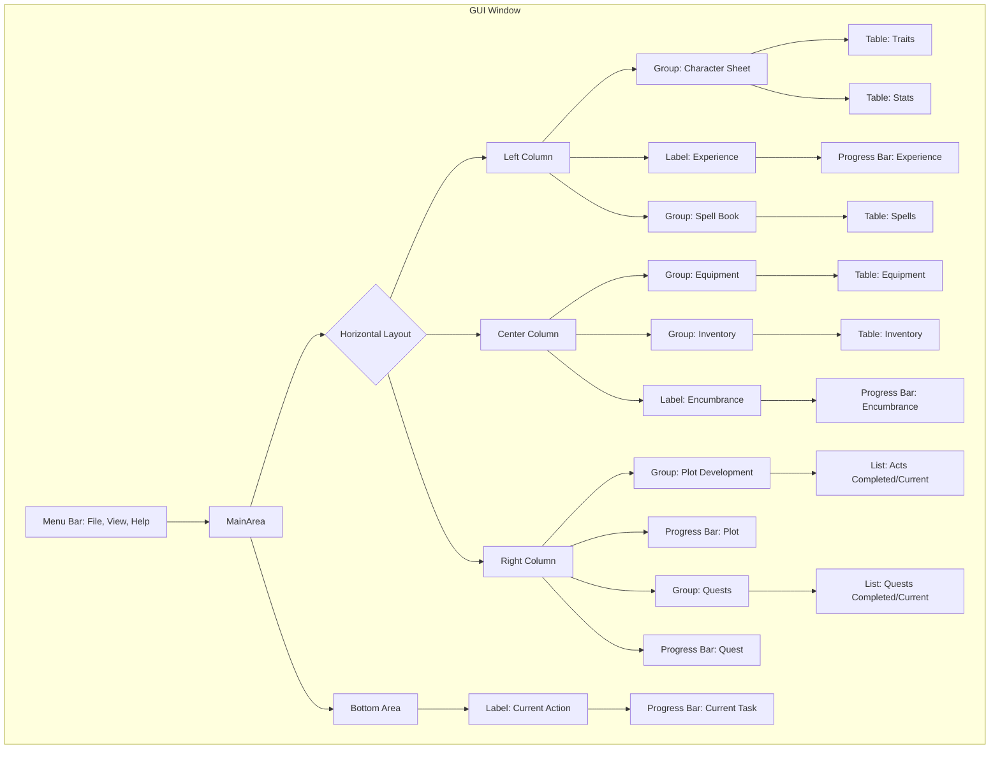

<!-- Zero Source Specification v1.0 -->
<!-- ZS:PROJECT:ProgressQuestTINS -->
<!-- ZS:TYPE:DesktopApplication -->
<!-- ZS:PLATFORM:CrossPlatform -->
<!-- ZS:LANGUAGE:Python -->
<!-- ZS:UI_TOOLKIT:PySide6 -->
<!-- ZS:COMPLEXITY:HIGH -->

# Progress Quest TINS Edition

## Description

This project describes "Progress Quest TINS Edition", a desktop application implementing the classic zero-player game, Progress Quest. Progress Quest is a satirical take on fantasy role-playing games where the character progresses automatically without any player interaction beyond initial character creation. The player's role is simply to watch their character embark on adventures, complete quests, gain levels, acquire loot, and interact with a simulated world.

This README serves as the sole source for an AI Language Model (LLM) to generate the complete, functional Python application using the PySide6 GUI toolkit. The goal is to replicate the core experience of Progress Quest in a desktop environment, focusing on the display of character progression and status.

## Functionality

### Core Features

1.  **Zero-Player Gameplay:** The application runs automatically once a character is loaded or created. The character performs actions like killing monsters, traveling, buying/selling items, and completing quests without user input.
2.  **Character Creation:** Allows users to "roll" a new character, including:
    *   Generating or entering a character name.
    *   Selecting a Race and Class from predefined lists, each providing specific stat bonuses.
    *   Rolling primary stats (STR, CON, DEX, INT, WIS, CHA) using a 3d6 method.
    *   Displaying rolled stats and their total.
    *   Ability to "Reroll" stats and "Unroll" to previous rolls.
    *   Saving the new character, potentially overwriting existing characters with the same name after confirmation.
3.  **Character Progression:**
    *   Characters gain Experience (XP) over time by completing tasks.
    *   Characters level up upon reaching XP thresholds, gaining improved stats (HP/MP Max), learning/improving spells, and enhancing base stats.
    *   Characters progress through Plot Acts, starting from Prologue, with increasingly longer completion times.
    *   Characters undertake and complete Quests automatically.
4.  **Inventory and Equipment:**
    *   Characters automatically acquire equipment for various slots (Weapon, Helm, Armor pieces, etc.). Better equipment replaces worse equipment.
    *   Characters accumulate items (loot from monsters, quest rewards, special items) in an inventory.
    *   Characters manage Encumbrance based on inventory items (excluding Gold) relative to their Strength (STR).
    *   Characters automatically sell excess inventory items when encumbrance is full.
    *   Characters automatically buy better equipment when they have sufficient Gold.
    *   Gold is acquired through selling items and completing tasks.
5.  **Spells:** Characters automatically learn and improve spells from a predefined list, influenced by their Wisdom (WIS) and Level.
6.  **Task System:** The character's current action is displayed, along with a progress bar showing time until completion. Actions are determined by a task queue and game logic (e.g., fighting, traveling, selling, plot cinematics).
7.  **Persistence:**
    *   Character state is saved automatically at regular intervals and upon closing the application.
    *   Character state can be saved manually via a menu option.
    *   Characters are saved to individual `.pqw` files (Base64 encoded JSON) in a `./savegame` directory.
    *   The application automatically loads the most recently modified `.pqw` file on startup.
    *   Users can manually load any `.pqw` file via a menu option (files outside the save directory are copied in).
8.  **Theming:** Supports applying visual themes using Qt Style Sheets (`.qss` files). Includes default light and dark themes and allows users to select custom theme files. The selected theme becomes the default for subsequent launches.
9.  **UI Display:** Provides a comprehensive view of the character's status, including traits, stats, equipment, inventory, spells, plot progression, quest log, and current action.

### User Interface

The main application window should be structured as follows:



**Key UI Elements & Behavior:**

*   **Window Title:** Displays "Progress Quest TINS Edition - \[Character Name]".
*   **Menu Bar:**
    *   **File:** New Character, Load .pqw File, Save .pqw File, Exit.
    *   **View:** Select Theme.
    *   **Help:** Visit Repository (opens GitHub URL), About (shows license/info dialog).
*   **Tables (Traits, Stats, Spells, Equipment, Inventory):**
    *   Display data in two columns (e.g., "Trait", "Value" or "Slot", "Item").
    *   Headers should be visible.
    *   Vertical headers (row numbers) should be hidden.
    *   Content should be non-editable by the user.
    *   Selection should be disabled.
    *   Column widths should adjust appropriately (some fixed, some stretch).
    *   Rows should be compact.
    *   Tables should update dynamically as game state changes. Inventory/Spells tables resize rows dynamically. Equipment/Traits/Stats tables have fixed rows.
*   **Lists (Plots, Quests):**
    *   Display single columns of text items.
    *   Selection should be disabled.
    *   Items should be added dynamically.
    *   Lists should scroll to the bottom when new items are added (especially Plots on new Act, Quests on new quest).
    *   Use icons/prefixes (e.g., `✓` for completed, `►` for current) to indicate status.
*   **Progress Bars (Exp, Encum, Plot, Quest, Task):**
    *   Visually represent progress from 0% to 100%.
    *   Display text indicating status (e.g., percentage, value/max, time remaining, hint text). Specific formats:
        *   Exp: "X XP needed - Y%" (tooltip: full hint)
        *   Encum: "Current/Max cubits" (tooltip: full hint)
        *   Plot: "Time remaining - Y%" (tooltip: full hint)
        *   Quest: "Y% complete" (tooltip: full hint)
        *   Task: "Y%" (tooltip: full hint)
    *   Update dynamically based on game state.
*   **Labels (Kill Label, Bar Labels):** Display static text or dynamic text (like the current action). Kill Label should be centered and bold.
*   **Dialogs:**
    *   **New Character:** Fields for Name (with random '?' button), Radio buttons for Race/Class, Display area for rolled Stats (with Total and color coding), Roll/Unroll buttons, Sold! (Accept)/Cancel buttons.
    *   **About:** Displays application title, version, and license text.
    *   **Theme Selector:** Standard file dialog to choose `.qss` files.
*   **Layout:** Use nested layouts (QVBoxLayout, QHBoxLayout) and QGroupBox widgets to achieve the three-column structure. Columns should resize appropriately. Use stretch factors to allocate space (e.g., Center wider than Left/Right).

### Behavior Specifications

1.  **Initialization:**
    *   Create the `./savegame` directory if it doesn't exist.
    *   Attempt to load the most recently modified `.pqw` file from `./savegame`.
    *   If successful, display the main window with the loaded character.
    *   If no saves exist or loading fails, show the New Character dialog.
    *   If the New Character dialog is accepted, create the character, save it, and show the main window.
    *   If the New Character dialog is cancelled, exit the application.
2.  **Game Loop:**
    *   A QTimer triggers `_tick` at `TICK_INTERVAL_MS`.
    *   `_tick` calculates elapsed time since the last tick.
    *   Calls the core game logic `process_tick` with the game state and elapsed time.
    *   Calls `update_ui` to refresh the display based on the (potentially modified) game state.
    *   Handles auto-save countdown.
3.  **UI Updates:** The `update_ui` function reads the current `game_state` dictionary and populates all relevant widgets (tables, lists, progress bars, labels) with the latest data.
4.  **Task Execution:**
    *   The `TaskBar` fills based on the current task's duration and elapsed time.
    *   When the `TaskBar` completes, `process_task_completion` logic runs (e.g., grant loot for kills).
    *   XP, Quest, and Plot progress bars are potentially incremented based on the completed task's duration.
    *   Checks for Level Up, Quest Completion, or Act Completion are performed if applicable.
    *   The next task is dequeued from the `queue` or determined by game logic (sell items if encumbered, buy items if rich, otherwise kill monsters).
    *   The `KillLabel` and `TaskBar` are updated for the new task.
5.  **Saving/Loading:**
    *   Saving encodes the `game_state` dictionary to JSON, then Base64, and writes to the `.pqw` file. Updates save timestamp and captures current PRNG state.
    *   Loading reads the file, decodes Base64, parses JSON into `game_state`. Restores PRNG state. Merges loaded state with default schema to handle missing fields gracefully. Recalculates transient UI data like bar hints.
6.  **Theming:** Loading a theme reads the `.qss` file content, applies it to the application instance, and overwrites `resources/default_theme.qss` with the selected theme's content (prepended with a warning comment). Ensures `resources/default_theme.qss` exists, creating it from `dark_theme.qss` if necessary on first run.
7.  **Window Closing:** Stops the game timer, triggers an auto-save, and then closes the application. If saving fails, prompts the user whether to quit anyway.

## Technical Implementation

---

### Architecture

* **Model-View Separation (Implicit):**
  - **Model:** The `game_state` dictionary and the functions in `game.py` represent the core data model and business logic. The `game.py` file contains all non-GUI-related logic and is self-contained in the sense that it does not depend on any UI toolkit. This allows it to function independently of the GUI and facilitates testing, such as with a `game_cli.py` file that interacts only with the core logic.
  - **View and Controller:** Each GUI implementation (e.g., `main.py` for PySide6, `main_tkinter.py` for Tkinter) serves as both the View and Controller. GUI-specific modules manage event handling (e.g., infinite loops, user actions, timers), interact with `game.py` to manipulate game state, and update the user interface accordingly. These GUI modules are fully independent of one another, allowing you to swap out the GUI toolkit by replacing `main.py` with another implementation (e.g., `main_tkinter.py`).

* **Main Components:**
  - **`game.py`:** Contains all core game logic, including constants, data structures, PRNG, character creation, progression logic, task generation, and save/load helpers. It is lightweight, reusable, and testable without GUI requirements.
  - **`main.py`:** Contains the PySide6-specific application setup, `MainWindow` class, UI element definitions, layout, event handling (timer, menus), dialog implementations, and any other interaction with `game.py`. It handles the event loop and acts as the intermediary between the GUI and the core game logic.
  - **`main_tkinter.py`:** Functions in a similar capacity as `main.py` but uses Tkinter instead of PySide6. It implements its own event handling and interface logic while interacting with `game.py` in the same way.

* **Event Loop:**  
  - The event loop is GUI-specific and resides in the respective GUI modules (`main.py`, `main_tkinter.py`, etc.). For example, the PySide6 implementation in `main.py` relies on the `QTimer` mechanism to trigger game progression ticks, while Tkinter would use its own timing mechanism (e.g., `after` method).

### Key Advantages of This Design:
1. **Modularity:**  
   Each GUI module operates independently, making it easy to swap out `main.py` for another implementation, such as `main_tkinter.py`, without affecting `game.py`.

2. **Reusability:**  
   The `game.py` file remains free of GUI-related dependencies, ensuring that it can be reused for testing (`game_cli.py`) or other potential applications.

3. **Simplified Abstractions:**  
   Instead of introducing an additional interface layer (e.g., `interface.py`), all controller-like responsibilities are consolidated within each GUI module (e.g., `main.py` or `main_tkinter.py`), keeping the architecture straightforward.

### Save File Format (`.pqw`)

The application persists the character's state in `.pqw` files located in the `./savegame` directory. These files contain a single Base64 encoded string, which, when decoded, reveals a JSON object representing the entire `game_state`.

**Core Principles:**

1.  **Format:** Base64(JSON(game_state))
2.  **Strict Order:** Fields *must* appear in the JSON object exactly in the order defined below. This is critical for compatibility testing and consistent loading/saving across versions.
3.  **Type Integrity:** Each field must strictly adhere to the specified data type.
4.  **Completeness:** All fields defined in this structure must be present in a valid save file.

**JSON Structure Definition:**

The decoded JSON object adheres to the following structure and field order:

```json
{
  "Traits": { "Name": "", "Race": "", "Class": "", "Level": 0 },
  "dna": [0.0, 0.0, 0.0, 0], "seed": [0.0, 0.0, 0.0, 0],
  "birthday": "", "birthstamp": 0,
  "Stats": {
    "seed": [0.0, 0.0, 0.0, 0],
    "STR": 0, "best": "", "CON": 0, "DEX": 0, "INT": 0,
    "WIS": 0, "CHA": 0, "HP Max": 0, "MP Max": 0
  },
  "beststat": "", "task": "", "tasks": 0, "elapsed": 0,
  "bestequip": "",
  "Equips": {
    "Weapon": "", "Shield": "", "Helm": "", "Hauberk": "",
    "Brassairts": "", "Vambraces": "", "Gauntlets": "",
    "Gambeson": "", "Cuisses": "", "Greaves": "", "Sollerets": ""
  },
  "Inventory": [["Gold", 0]],
  "Spells": [["", ""]], "act": 0, "bestplot": "", "Quests": [""],
  "questmonster": "", "kill": "",
  "ExpBar": { "position": 0.0, "max": 0, "percent": 0, "remaining": 0, "time": "", "hint": "" },
  "EncumBar": { "position": 0, "max": 0, "percent": 0, "remaining": 0, "time": "", "hint": "" },
  "PlotBar": { "position": 0.0, "max": 0, "percent": 0, "remaining": 0, "time": "", "hint": "" },
  "QuestBar": { "position": 0.0, "max": 0, "percent": 0, "remaining": 0, "time": "", "hint": "" },
  "TaskBar": { "position": 0, "max": 0, "percent": 0, "remaining": 0, "time": "", "hint": "" },
  "queue": [""], "date": "", "stamp": 0, "saveName": "",
  "bestspell": "", "bestquest": "", "questmonsterindex": 0
}
```

**Field Explanations:**

1.  **`Traits`** (`Object/Dictionary`)
    *   Contains fundamental character identification.
    *   `Name` (`String`): The character's chosen name.
    *   `Race` (`String`): The character's selected race.
    *   `Class` (`String`): The character's selected class.
    *   `Level` (`Unsigned Integer`): The character's current experience level.

2.  **`dna`** (`Array[Float, Float, Float, Unsigned Integer]`)
    *   The persistent state of the Pseudo-Random Number Generator (PRNG) *at the exact moment the character's initial stats were rolled*.
    *   Used by the "Unroll" feature during character creation to revert to previous stat rolls.
    *   Float values must preserve high precision (e.g., `0.1234567890123456`).

3.  **`seed`** (`Array[Float, Float, Float, Unsigned Integer]`)
    *   The state of the PRNG *at the moment the game was saved*.
    *   This state is loaded to ensure that subsequent random events continue deterministically from where they left off.
    *   It is distinct from `dna` and `Stats.seed`.
    *   Float values must preserve high precision.

4.  **`birthday`** (`String`)
    *   A human-readable timestamp indicating when the character was created (e.g., "Fri Mar 08 2019 18:45:30 GMT-0400 (Country)").

5.  **`birthstamp`** (`Unsigned Integer`)
    *   A numerical timestamp (likely milliseconds since the Unix epoch) representing the character's creation time. Corresponds to `birthday`.

6.  **`Stats`** (`Object/Dictionary`)
    *   Stores the character's attributes.
    *   `seed` (`Array[Float, Float, Float, Unsigned Integer]`): The PRNG state used to roll these stats. **Must be identical** to the top-level `dna` field.
    *   `STR`, `CON`, `DEX`, `INT`, `WIS`, `CHA` (`Unsigned Integer`): The character's rolled base values for the six primary statistics.
    *   `best` (`String`): The name (e.g., "INT") of the primary stat that had the highest value *at the time of creation*.
    *   `HP Max`, `MP Max` (`Unsigned Integer`): The character's maximum Hit Points and Mana Points, respectively. These increase upon leveling up.

7.  **`beststat`** (`String`)
    *   A formatted string representing the character's *current* highest primary stat and its value (e.g., "INT 16049"). Recalculated on load/level up.

8.  **`task`** (`String`)
    *   An internal identifier string representing the character's *currently executing* action. Used by the game logic after the task timer completes to determine outcomes (e.g., "kill|Stegosaurus|18|plate", "buying", "market", "sell", "heading", "plot_loading"). Format "Action|TargetName if any|Qty if any|Type of Reward or \* random calc"

9.  **`tasks`** (`Unsigned Integer`)
    *   A counter accumulating the total number of discrete tasks the character has completed since creation.

10. **`elapsed`** (`Unsigned Integer`)
    *   The total in-game time elapsed, measured in seconds, accumulated from the durations of completed tasks.

11. **`bestequip`** (`String`)
    *   The display name of the most recently acquired significant piece of equipment (e.g., "+levelNum Element Material Equipment Name"). Recalculated on load/equip change.

12. **`Equips`** (`Object/Dictionary`)
    *   Maps equipment slot names (`String` keys like "Weapon", "Shield", "Helm", etc. from `EQUIPS` constant) to the name (`String` value) of the item currently equipped in that slot. An empty string signifies an empty slot.

13. **`Inventory`** (`Array[Array[String, Unsigned Integer]]`)
    *   A list representing the character's inventory. Each element is a two-item array: `[ItemName <String>, Quantity <Unsigned Integer>]`.
    *   The list *must* always contain `["Gold", quantity]` (usually as the first element). Other elements represent various collected items (loot, quest items, etc.).

14. **`Spells`** (`Array[Array[String, String]]`)
    *   A list representing the character's known spells. Each element is a two-item array: `[SpellName <String>, Level <Roman Numeral String>]` (e.g., `["Sadness", "MDCXXXIX"]`).
    *   The list is kept sorted alphabetically by `SpellName`.

15. **`act`** (`Unsigned Integer`)
    *   The current plot act the character is progressing through. `0` represents the Prologue, `1` is Act I, etc.

16. **`bestplot`** (`String`)
    *   A display string for the current act (e.g., "Prologue", "Act LI"). Recalculated on load/act completion from incremented `act` value to roman (e.g., 51 > "Act LI").

17. **`Quests`** (`Array[String]`)
    *   A list of quest description strings. The character works on the quest described by the *last* string in the list. The list has a fixed maximum size (e.g., 100); older quests are removed as new ones are added.

18. **`questmonster`** (`String`)
    *   An internal identifier string for the target monster of the current 'Exterminate' quest (e.g., "Stegosaurus|18|plate"). This is used internally by the game logic but is often empty in the save file if the current quest isn't an 'Exterminate' type or if the logic clears it between ticks.

19. **`kill`** (`String`)
    *   The user-facing text displayed in the UI describing the character's current action, usually ending with "..." (e.g., "Executing 5 massive Stegosauri...").

20. **`ExpBar`, `EncumBar`, `PlotBar`, `QuestBar`, `TaskBar`** (`Object/Dictionary`)
    *   Objects storing the state data for each of the main UI progress bars. They share a common structure:
    *   `position` (`Float` for Exp, Plot, Quest; `Unsigned Integer` for Encum, Task): The current progress value.
    *   `max` (`Unsigned Integer`): The value representing 100% completion for this bar.
    *   `percent` (`Unsigned Integer`): The calculated progress percentage (0-100).
    *   `remaining` (`Float` or `Unsigned Integer` matching `position`): Calculated value remaining (`max - position`).
    *   `time` (`String`): Human-readable representation of the remaining time (used for Exp, Plot) or empty string.
    *   `hint` (`String`): Text intended for tooltips, often summarizing the bar's status.

21. **`queue`** (`Array[String]`)
    *   A list of task strings queued for future execution, processed First-In, First-Out.
    *   Used primarily for cinematic sequences between acts or multi-step actions.
    *   Format: `"task_type|duration_seconds|description"` (e.g., `"task|10|Experiencing an enigmatic..."`, `"plot|2|Loading"`).

22. **`date`** (`String`)
    *   A human-readable timestamp indicating when the game was *last saved*.

23. **`stamp`** (`Unsigned Integer`)
    *   A numerical timestamp (likely milliseconds since the Unix epoch) corresponding to the last save time (`date`).

24. **`saveName`** (`String`)
    *   Defaults to the character's name, often used internally or for display related to the save file name itself. Typically identical to `Traits.Name`.

25. **`bestspell`** (`String`)
    *   A formatted string representing the character's current "best" spell based on an internal heuristic (e.g., "Spectral Miasma MCCCLIII"). Recalculated on load/spell gain.

26. **`bestquest`** (`String`)
    *   The description string of the currently active quest (copied from the last element in the `Quests` array). Recalculated on load/quest change.

27. **`questmonsterindex`** (`Integer`)
    *   The index within the game's internal `MONSTERS` list that corresponds to the target of the current 'Exterminate' quest. Value is `-1` if the current quest does not have a specific monster target from that list.

### Core Algorithms & Logic

*   **PRNG (`random_alea`, `Random`, `Pick`, etc.):** Alea-like pseudo-random number generation based on a mutable state array (`_alea_state`). Used for all random decisions (stat rolls, item/monster generation, choices). Must be seedable and allow state get/set for saving/loading and the Unroll feature.
*   **Stat Rolling (`roll_stats`):** Generates 6 primary stats using 3d6 method. Calculates initial HP/MP. Determines and stores the highest rolled stat ("best"). Captures the PRNG state used for the roll.
*   **Task Processing (`process_tick`, `process_task_completion`):** The main game loop driver. Advances the current task's progress bar. On completion, applies task effects (loot, gold, etc.), updates progression bars (XP, Quest, Plot), checks for level/quest/act completion triggers, and determines the next task based on game state (queue > encumbrance/sell > buy > kill).
*   **Progression (`level_up`, `complete_quest`, `complete_act`):** Handle the logic for advancing levels (stat gains, spell gains, XP bar reset), completing quests (rewards, new quest generation), and advancing plot acts (rewards, plot bar reset, cinematic queueing).
*   **Item/Monster Generation (`win_item`, `win_equip`, `monster_task`, `named_monster`):** Combine PRNG with constant lists and level-based selection logic (`_lpick`, `RandomLow`) to generate appropriate challenges and rewards. Includes applying positive/negative modifiers based on level differences.
*   **Progress Bar Updates (`update_bar_max`, `set_bar_position`, `increment_bar`):** Calculate and update the `position`, `max`, `percent`, `remaining`, `time`, and `hint` fields within the respective bar dictionaries in `game_state`.

### Persistence

*   **Format:** Game state dictionary serialized to JSON, then encoded to Base64.
*   **Storage:** Saved in individual files named `{CharacterName}.pqw` within a `./savegame` sub-directory relative to the application's execution path.
*   **Loading:** Must handle potential missing keys in older save files by merging the loaded data into the default schema structure. Must restore the PRNG state from the save file.

## Style Guide

*   **Visual Theme:** The application should support light and dark themes via `.qss` files located in a `./resources` sub-directory. Default themes (`dark_theme.qss`, `light_theme.qss`) should be provided. The application loads `default_theme.qss` on startup. Selecting a theme via the View menu should apply it immediately and overwrite `default_theme.qss` (after adding a standard warning comment).
*   **Layout:** Adhere to the three-column layout described in the UI section. Use spacing and margins for a clean look (refer to `main.txt` for specific values if needed, e.g., spacing 2-4px, margins 6px). Widgets within groups should have minimal margins.
*   **Widget Appearance:** Tables and lists should be compact. Progress bars should clearly display their text information.

## Testing Scenarios (Optional)

*   Verify character creation allows rolling, unrolling, race/class selection, and saving.
*   Confirm saving and loading accurately preserves all aspects of the game state, including PRNG state.
*   Observe automatic progression: XP gain leads to level up, quest completion leads to new quests, plot completion leads to new acts.
*   Ensure inventory updates correctly when items are gained (loot, rewards) and lost (selling).
*   Check that encumbrance fills, triggers selling behavior, and selling correctly adds gold and removes items.
*   Verify equipment changes automatically when better items are generated via `win_equip` or buying.
*   Confirm spells are learned and leveled up correctly.
*   Test theme selection applies the chosen theme and updates the default.
*   Ensure the UI accurately reflects the underlying `game_state` after each tick.